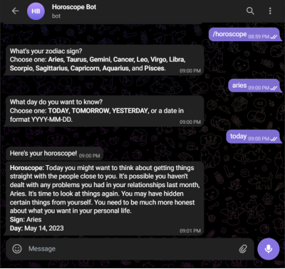

# Horoscope-Bot-using-Python
A Telegram bot developed to tell the user his horoscope using a simple telegram commands.

## Libraries
The libraries we need for this project are: `telebot` and `requests`. Telebot is the python libary for creating a telegram bot.
```Python
import telebot, requests
```

## How to get a Bot Token
For setting a new bot, we need to contact Botfather. Botfather manages all the bots that are created via the user account on Telegram.

## The Bot Token 
After getting a bot token from BotFather, we assign it to a variable `Bot_Token` and then use the same token to create a bot instance of the bot class.
```Python
BOT_TOKEN = "Your-Telegram-Bot-Api"
bot = telebot.TeleBot(BOT_TOKEN)
```

## Adding Message handlers
Using the Horoscope API explained on [this site](https://blog.ashutoshkrris.in/how-to-create-a-horoscope-api-with-beautiful-soup-and-flask) we use the API hosted on heroku for generating the horoscope of the inputs entered by the user. 

```Python
@bot.message_handler(commands=['start', 'hello'])
def send_welcome(message):
    bot.reply_to(message, "Howdy, how are you doing?")

@bot.message_handler(commands=['horoscope'])
def sign_handler(message):
    text = "Can I know your zodiac sign?\nChoose one from the following: *Aries*, *Taurus*, *Gemini*, *Cancer,* *Leo*, *Virgo*, *Libra*, *Scorpio*, *Sagittarius*, *Capricorn*, *Aquarius*, and *Pisces*."
    sent_msg = bot.send_message(message.chat.id, text, parse_mode="Markdown")
    bot.register_next_step_handler(sent_msg, day_handler)
```

## Feching the Horoscope data
We create some functions to accept the incoming data from the API in JSON format and then convert it into normal text and store it into variable to reply with outcome of user inputs.

```Python
def get_daily_horoscope(sign: str, day: str) -> dict:
    """Get daily horoscope for a zodiac sign.
    Keyword arguments:
    sign:str - Zodiac sign
    day:str - Date in format (YYYY-MM-DD) OR TODAY OR TOMORROW OR YESTERDAY
    Return:dict - JSON data
    """
    url = "https://horoscope-app-api.vercel.app/api/v1/get-horoscope/daily"
    params = {"sign": sign, "day": day}
    response = requests.get(url, params)

    return response.json()

def day_handler(message):
    sign = message.text
    text = "What day do you want to know?\nChoose one: *TODAY*, *TOMORROW*, *YESTERDAY*, or a date in format YYYY-MM-DD."
    sent_msg = bot.send_message(
        message.chat.id, text, parse_mode="Markdown")
    bot.register_next_step_handler(
        sent_msg, fetch_horoscope, sign.capitalize())

def fetch_horoscope(message, sign):
    day = message.text
    horoscope = get_daily_horoscope(sign, day)
    data = horoscope["data"]
    horoscope_message = f'*Horoscope:* {data["horoscope_data"]}\n*Sign:* {sign}\n*Day:* {data["date"]}'
    bot.send_message(message.chat.id, "Here's your horoscope!")
    bot.send_message(message.chat.id, horoscope_message, parse_mode="Markdown")
```

## Launching the bot 
Now the only thing remaining is to launch the bot and to do it we add the following line to the end of the code.

```Python
bot.infinity_polling()
```

## Snaps of the project
<p align=center>
  
</p>